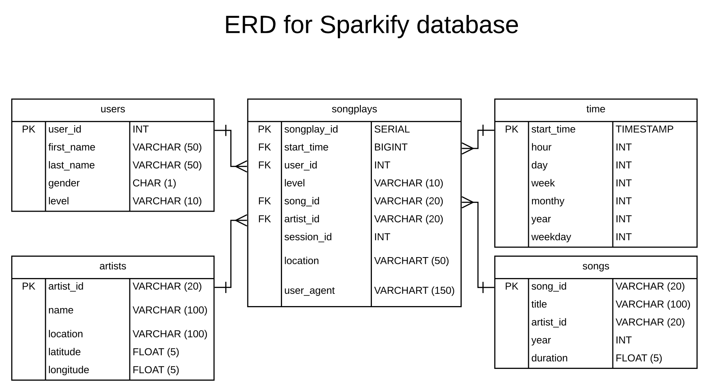

# Data_lake_AWS

Data lake project in AWS using HDFS and S3:

This is an ETL (extract, transform, load) data project of a fictional company called Sparkify where a set of JSON files containing a music songs and user usaga data are stored in AWS S3 servers. 
The task is to create a set of dimensional tables in a star schema to be stored back into AWS S3 for the company's analytical team study of usage behaviour.

## Data source

### This contains the song database:
Song data: s3://udacity-dend/song_data
### This one contains the user log:
Log data: s3://udacity-dend/log_data

The song data files area in JSON format and contain metadata about a song and the artist of that song. The files are partitioned by the first three letters of each song's track ID. For example, here are filepaths to two files in this dataset:
`song_data/A/B/C/TRABCEI128F424C983.json`

`song_data/A/A/B/TRAABJL12903CDCF1A.json`

Below is an example of what a single song file, TRAABJL12903CDCF1A.json, looks like:

`{"num_songs": 1, "artist_id": "ARJIE2Y1187B994AB7", "artist_latitude": null, "artist_longitude": null, "artist_location": "", "artist_name": "Line Renaud", "song_id": "SOUPIRU12A6D4FA1E1", "title": "Der Kleine Dompfaff", "duration": 152.92036, "year": 0}`

The second dataset, log files (user log) is also in JSON format, based on the songs in the dataset above. 

The log files are partitioned by year and month. For example, here are filepaths to two files in this dataset.
`log_data/2018/11/2018-11-12-events.json`

`log_data/2018/11/2018-11-13-events.json`

## Requirements:

AWS credentials with enough credits to run S3

Python 3.8 

## Star schema:

